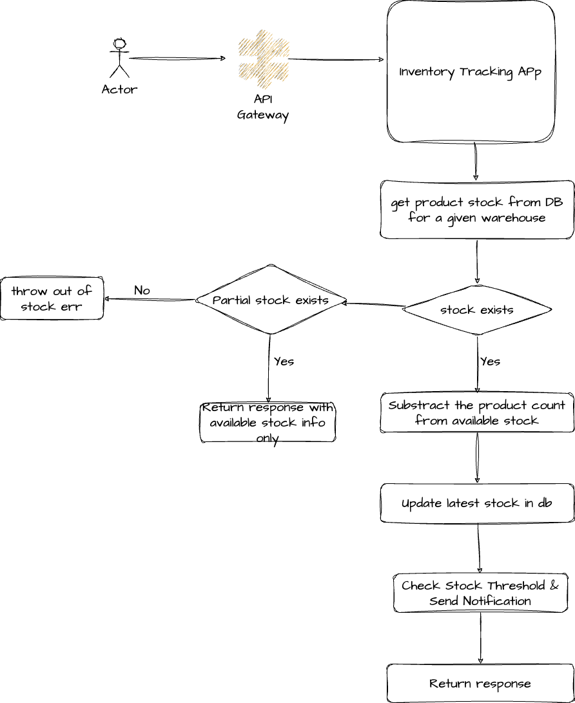
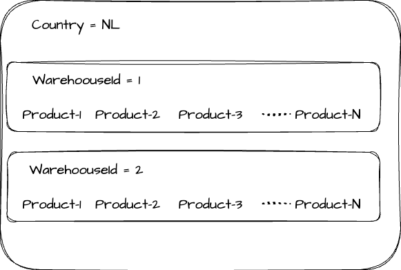
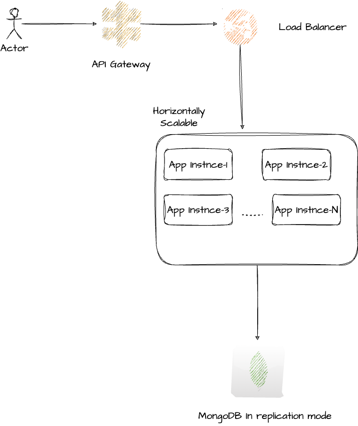

## Description

### Challenge

Develop a simple Inventory Tracking Servicelication with two main functionalities

- Receiving invetory update
- Sending Notification

`The application will handle inventory updates and initiate notification via a webhook only when stock-level decreases and surpasses a predefined level`

### Functional Requirements

- Implement an API to update product stock
- Send notification if stock decreases beyond predefined level
- Provide simulated endpoint or mechanism for demonstrating webhook functionality

### Non-Functional Requirements

- Document Architecture
- Logic behind Notification thresold
- Setup instructions and usage guidelines
- Scalablilty, DDD, Docker

## Flow Diagram



## Assumptions

- Product Stock architecture
  

- Update stock api will be used during the checkout flow.
- Start with MVP and then improve the system for scalability, loose-coupling

### Notification Threshold (Notification Severity)

I have defined the following `notification severity levels`. These values are configurable

- `Blocker` --> Will be send when stock is `<=0`
- `Critical` --> Will be send when stock is `<=100`
- `Medium` --> Will be send when stock is `<=1000`
- `Low` --> Notification will not be sent when stock is `<=5000`

## Architecture Diagram v1

- This service is exposing an API to update product stock. If the stock goes below predefined threshold then this service will send the nofication using webhook
- It can be scaled independently
- Mongodb is being used in replication mode.



## Prerequisite

- Docker

## Tech Stack

- Node.js
- Typescript
- Nestjs
- MongoDB
- TypeOrm
- Docker

## Installation

1. Clone the repo

```bash
$ git clone https://github.com/harsh-sri/inventory-tracking-app
```

2. Switch to project directory

```bash
$ cd inventory-tracking-app
```

### Notification Webhook Simulation

- [Follow the instructions mentioned here](https://learning.postman.com/docs/designing-and-developing-your-api/mocking-data/setting-up-mock/#creating-mock-servers)

## Environment Setup

- Create a `.env` file in the project root folder
- Copy the env keys from `env.sample` and provide the correct values

## Directory Structure

```
├── assets
├── scripts
├── src
│   ├── common
│   │   ├── constants
│   │   ├── controllers
│   │   ├── docs
│   │   │   └── interfaces
│   │   ├── enums
│   │   ├── exceptions
│   │   │   └── interfaces
│   │   ├── filters
│   │   │   └── serializers
│   │   │       └── docs
│   │   └── pipes
│   ├── core
│   │   ├── config
│   │   └── logger
│   │       ├── enums
│   │       └── interface
│   ├── health-check
│   ├── infra
│   │   └── http
│   ├── notification
│   │   └── interfaces
│   └── stock
│       ├── controllers
│       ├── dto
│       ├── entities
│       ├── enums
│       ├── interfaces
│       ├── serializers
│       └── services
├── static
└── test
```

## Running the app

Start the application using Docker. App will run on PORT 3000

```bash
$ docker-compose up --build
```

### Sample Request

```bash
$ curl --location --request PATCH 'localhost:3000/api/v1/stock/6f7a3e2f-b442-4982-9e4a-4d829c11fffd' \
--header 'Content-Type: application/json' \
--data '{
    "warehouseId": "317f7cf7-3ff4-4540-acf3-6b6a053efbaf",
    "productCount": 1
}'
```

## Test

```bash
# unit tests
$ npm run test
```

- To Test APIs, please use following `productId` and `warehouseId`
  - `productId: 6f7a3e2f-b442-4982-9e4a-4d829c11fffd`
  - `warehouseId: 317f7cf7-3ff4-4540-acf3-6b6a053efbaf`

Note: We can also generate the random productId and warehouseId. We need to update the `scripts/populate.js`

## API Docs

```
http://localhost:3000/docs
```

### Notes

- Added a script to populate db when we start this app locally for testing purpose
